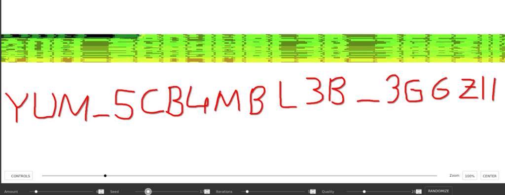

# 🕛 Midnight Sun CTF 2025 - Cemoni Write-up

This repository contains the write-up for the **Cemoni** challenge from the Midnight Sun CTF 2025.

**Category:** `Misc`
**Challenge URL:** `cccemoni.play.hfsc.tf:11223`

## 🧩 Challenge Description

> It seems the challenge wants us to play and solve.
> Do not be fooled by its apparent simplicity.

When visiting the challenge URL, a webpage is served showing an image in the center. Although the CTF had ended, the page still contained a visual hint — the flag was embedded in an image (`/flag.png`) but not immediately visible.

> Although it was not visible because the CTF had ended, the flag could be seen illegibly in the middle of the site

```html
<!DOCTYPE html>
<html lang="en">
<head>
    <meta charset="UTF-8">
    <meta name="viewport" content="width=device-width, initial-scale=1.0">
    <title>Glotchy Flag</title>
    <style>
        body, html {
            margin: 0;
            padding: 0;
            width: 100%;
            height: 100%;
            overflow: hidden;
            background-image: url('/bg.gif');
            background-size: cover;
            background-position: center;
            background-repeat: no-repeat;
            display: flex;
            align-items: center;
            justify-content: center;
        }
        .image-container {
            width: 90%;
            max-width: 2100px;
            display: flex;
            align-items: center;
            justify-content: center;
        }
        #challengeImage {
            max-width: 100%;
            height: auto;
            object-fit: contain;
            image-rendering: pixelated; /* Keeps pixels sharp */
            image-rendering: -moz-crisp-edges;
            image-rendering: crisp-edges;
        }
    </style>
</head>
<body>
    <div class="image-container">
        
    </div>
</body>
</html>
```

## 🔍 Analysis

1. **Initial Inspection**: Viewing the HTML source reveals an `` element displaying `/flag.png`. This file was downloaded locally.

2. **Image Analysis**:

   * Initial inspection didn't reveal anything obvious.
   * Tried tools like [Incoherency Image Steganography Tool](https://incoherency.co.uk/image-steganography/#unhide).
   * Applied various contrast and filter adjustments in an image editing tool to reveal the scrambled flag.

3. **Final Hint**: After trying several image manipulation methods, the hidden flag finally emerged from the scrambled pixels.

## 🖼️ Screenshots

### Challenge page as served


### `flag.png` initially downloaded


### Processed flag image after image manipulation


### Final flag revealed



## 📢 Solution

The flag was hidden using simple image scrambling techniques.

**FLAG:** `midnight{YUM_SCR4MBL3D_3G6Z!!}`

## ✨ Credits

Challenge created by the Midnight Sun CTF 2025 team.
Write-up by Cemoni.

---
